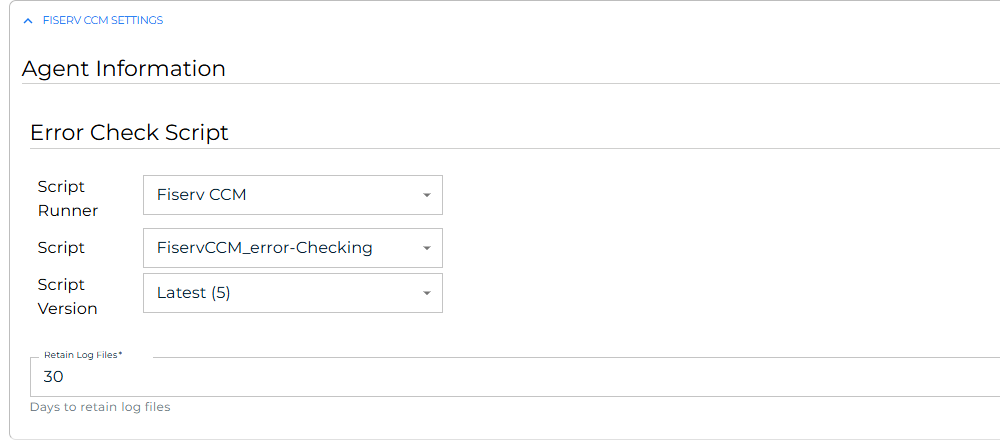

# Define the FiservCCM Connector agent

**Theme:** Configure  
**Who Is It For?** System Administrator, Automation Engineer

## What is it?

Before OpCon can submit jobs to the Fiserv CCM database, you must define two objects in Solution Manager: a FiservCCM script that contains the error checking information, and an agent definition that references that script.

- Use agent-scripts.md to assist with creating the error checking script. 

All definitions are performed in Solution Manager.

## Define the FiservCCM Connector agent

After the script is created, define the agent in Solution Manager.

To define the agent, complete the following steps:

1. In Solution Manager, select **Library**.
2. From the **Administration** menu, select **Agents**.
3. Select **+Add**.
4. In the **Name** field, enter a unique name for the connection.
5. In the **Type** field, select **Fiserv CCM** from the list.
6. Select **General Settings**.
7. Verify that the **NetCom Name** field is set to **Default**, or enter the name of the SMA Relay if a relay is in use.
8. Select **Fiserv CCM Settings**.
9. In the **Error Check Script** section, select the script that contains the `error checking` information.
10. In the **Retain Log files** field, enter the number of days to retain log files.
11. Select the **Save** button.
12. Select **Communication Settings**.
13. Verify that the **Requires XML Escape Sequences: User-Defined** field is set to **True**. If it is not, set it to **True** and select the **Save** button.
14. Select the **Change Communication Status** button and select **Enable Full Comm**. The agent connection is established.

## FAQs

**What does the NetCom Name field control?**  
The **NetCom Name** field determines which OpCon communication channel the agent uses. Use **Default** for standard on-premises deployments. If your environment routes agent communication through a named relay, enter the relay name here.

**Why must XML escape sequences be enabled?**  
Kubernetes job definitions include YAML content that contains characters such as `<`, `>`, and `&` that must be escaped when transmitted through the OpCon communication protocol. Enabling this setting ensures those characters are transmitted correctly.

## Glossary

**NetCom** — The OpCon network communication layer that handles message exchange between the OpCon server and agents.

**Script Repository** — The OpCon library where reusable scripts are stored and versioned. Scripts can be assigned roles for access control and referenced from agent and job definitions.