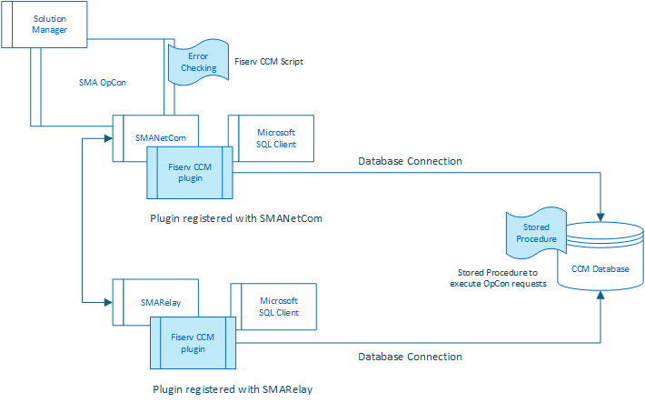

# Fiserv CCM Connector

## What is it?

The Fiserv CCM Connector is an OpCon connector for Fiserv CCM (Credit Card Management for DNA).

The Integration was developed for the purpose of starting, monitoring and reporting on a scheduled task within Credit Card Management for DNA.
 - Tasks are created and task parameters are configured in the CCM application. None are passed in by the integration.    
 - This integration will start the CCM task by inserting a taskid (@task_nbr) into the SchTaskQue table in the CCM database.    
 - A task user (@task_usr) is also passed in for audit purposes.     
 - This task user is not validated against a user list, it is a string (up to 50 characters) used for auditing/reporting only.    

The integration consists of the ACS Fiserv CCM plugin, which communicates with the Fiserv CCM SQL Server database using the SQL CMD Client and SQL statements.
The integration uses the SQLCMD.exe client to submit the stored procedure and monitor it as it runs. 
Once the stored procedure finishes, step history information is retrieved from the database (depends on which Severity options were selected for the task) and included in the OpCon JobLog. 
The Error Severity option is always returned, but will only be included in the job log if the Error Severity option is selected or the task has an error condition.

If an error condition occurred **Error Checking** is invoked by checking the error returned during the step history information retrieval with error definitions in the Error Checking OpCon script. These definitions indicate whether a specific error condition can be marked as completed successfully. The major purpose for this functionality is to prevent workflows stopping with a recoverable error condition.

### Components
**Fiserv CCM** plugin provides the link between the OpCon environment and the Fiserv CCM database.
**Error Checking** OpCon script that contains information about recoverable error conditions.
**Stored Procedure** which is inserted into the Fiserv CCM database that the integration runs, passing a task id.
**SQL Server Client** the Microsoft SQL Server Client software that contains the SQLCMD.exe utility used to run and monitor the status of the stored procedure.

The plugin can be installed either within the OpCon file structure for On-Premises environments or within the SMARelay structures for OpCon Cloud environments. 

<!--
## FAQs
  - Which OpCon versions and which Fiserv CCM versions are supported?
    Requires OpCon Cloud or OpCon OnPrem 26.0.x 
  - What credentials or connection details does the connector require?
    Requires a valid database user.
    Requires information about the target database and stored procedure to execute. 
  - How is the connector installed and licensed?
Do not author answers until the supporting facts are confirmed by an SME.
-->

## Glossary

**ACS** - Stands for Agentless Connection System which is a new framework provided by OpCon to support integrations. 
**CCM** - Stands for Fiserv DNA Credit Card Management.
**SQLCMD.exe** - Is part of the Microsoft SQL Server Client software which needs to be installed on the same server as the integration.
**Stored Procedure** - Stored procedures are used to group one or more Transact-SQL statements into logical units. The stored procedure is stored as a named object in the SQL Server Database Server

