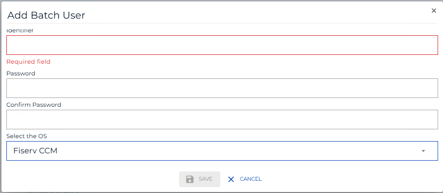

# Define FiservCCM Batch Users

**Theme:** Configure | **Audience:** System Administrator

## What is it?

The FiservCCM integration requires OpCon batch users to supply credentials for the Fiserv CCM SQL Server database. These users are created once and then selected by name when configuring a task.

The following batch users are required:
- The SQL Server User.

## Define a batch user

To define FiservCCM batch users, complete the following steps:

1.  Open Solution Manager.
2.  From the Home page select **Library**.
3.  From the **Security** menu select **Batch Users**.
4.  Select **+Add** to add a new Batch User.
5.  Select **Fiserv CCM** from the **Select the OS** list.
6.  In the **Identifier** field, enter the SQL Server login name the connector signs in with.
7.  Enter the password of that SQL Server login in the **Password** and **Confirm Password** fields.
8.  Select **Save**.

Repeat for each required batch user.